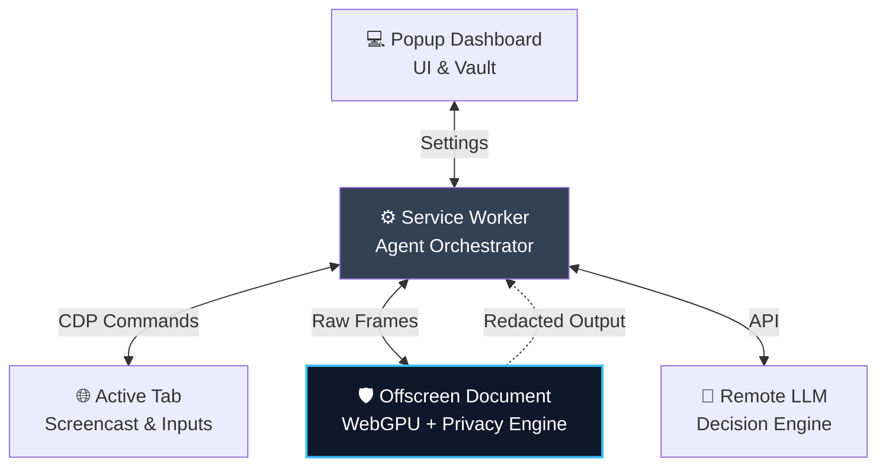

<div align="center">
  <h1>🛡️ LensAgent</h1>
  <p><b>Privacy-Preserving Visual Browser Agent</b></p>

  
  
  
  
</div>

<br/>

LensAgent is an advanced, autonomous browser automation agent built entirely as a Chrome Extension. It leverages **local WebGPU vision models** and a **Fail-Closed Privacy Engine** to execute complex multi-step workflows (e.g., navigating, filtering, downloading) without ever leaking sensitive user data to the cloud.

Developed for **SIH-171: On-device WebGPU visual perception, Indian PII redaction, and autonomous CDP browser execution with zero raw data egress.**

---

## ✨ Key Features

* 🕵️ **Zero-Data-Egress Privacy Engine**
  * **Local Redaction:** Real-time canvas redaction of PII (Aadhaar, PAN, Credit Cards, Emails, Passwords, etc.) before image frames leave the browser.
  * **Stylized Masking:** Sensitive data is seamlessly masked with context-aware jargon (e.g., [REDACTED_CARD_****], [REDACTED_AVATAR]).
  * **Fail-Closed Security:** If any part of the redaction pipeline fails, the frame is immediately dropped.

* 🤖 **Tri-Stream Context Architecture**
  * Provides the LLM with three parallel, redacted streams of data:
    1. **Visual Stream:** 30 FPS Screencast frames via CDP.
    2. **DOM Snapshot:** Structured DOM querying for bounding boxes.
    3. **A11y Tree:** Full accessibility tree filtered for interactive roles.

* 🎯 **Set-of-Mark (SoM) Visual Grounding**
  * Annotates detected UI elements with numeric IDs (e.g., [1], [2]), allowing the agent to reference specific elements securely without guessing pixel coordinates.

* ⚡ **WebGPU Vision Models**
  * Powered by **Transformers.js** running Xenova/owlvit-base-patch16 for zero-shot object detection.
  * Operates safely within an air-gapped Chrome Offscreen Document.

* 🖱️ **Human-like CDP Execution**
  * Uses the Chrome DevTools Protocol (chrome.debugger) to synthesize native input.
  * Implements **Gaussian mouse jitter**, variable inter-key typing cadences, and smooth scrolling for undetectable, human-like interaction.

* 🔐 **Zero-Knowledge Identity Vault**
  * Users pre-fill details locally. When the LLM decides to type a token like `<VAULT_EMAIL>`, the local extension intercepts and injects the real data directly via CDP. The AI never sees the raw PII.

---

## 🏗️ Architecture



LensAgent is composed of four tightly integrated layers:

1. **Service Worker (`background/service-worker.js`)**: Orchestrates the agent loop, manages the CDP debugger connection, and bridges communications between the frontend and the Offscreen document.
2. **Offscreen Document (`offscreen.html`)**: The heavy-lifting sandbox. Hosts the **WebGPU Transformers** pipeline and the **Privacy Engine** for hardware-accelerated image decoding, ML inference, and canvas redaction.
3. **Popup Dashboard (`popup.html`)**: The user interface. Displays real-time telemetry, live video feeds of the agent's viewport, execution logs, and the Identity Vault settings.
4. **Action Executor**: Hooks directly into the active tab via CDP to push 30fps frames and inject mouse/keyboard events, adjusting coordinates dynamically using the device pixel ratio (DPR).

---

## 🚀 Installation & Setup

1. Clone the repository:
   ```bash
   git clone https://github.com/ashroxy/LensAgent.git
   cd LensAgent
   ```
2. Open Google Chrome (or any Chromium-based browser) and navigate to `chrome://extensions/`.
3. Enable **Developer mode** in the top right corner.
4. Click **Load unpacked** and select the root `LensAgent` directory.
5. Click the extension icon to open the Agent Dashboard.
6. Configure the Backend URL in the **Settings** tab.
7. Fill out your mock data in the **Vault** tab.
8. Navigate to a target webpage, enter a goal in the popup, and click **Start**.

---

## 📅 Development History

LensAgent was developed iteratively by a 4-person team specializing in Infrastructure, Vision ML, Privacy, and Backend integration.

| Version | Milestone | Description |
| :--- | :--- | :--- |
| **v6.0** | **WebGPU Transformers & Production UI** | Complete frontend UI overhaul. Migrated to owlvit-base-patch16 zero-shot detection via WebGPU. Enhanced Privacy Engine with stylized placeholders. |
| **v5.2** | **Privacy Engine Integration** | Real PII detection, context-aware confidence scoring, zero-leakage validation, and shadow DOM accessibility tree builders. |
| **v4.0** | **UI Pro Max** | Redesigned the extension popup into a robust operate-mode dashboard with real-time video feeds. |
| **v3.1** | **Tri-Stream Architecture** | Extracted DOM snapshots and A11y trees in parallel with the visual stream to eliminate hallucination. |
| **v2.0** | **Full Enhancement Pass** | Added robust human-like input emulation (Gaussian jitter, typing cadence), dynamic DPR normalizations. |
| **v1.0** | **Initial Infrastructure** | Built the CDP screencast engine, MV3 service worker lifecycle, and the Offscreen Document bridge. |

---

## 🛡️ Cross-Browser Compatibility

LensAgent is a **Chrome-first extension**. The core automation pipeline fundamentally relies on the `chrome.debugger` API (CDP) for high-performance screencasting and input injection.
* ✅ **Supported:** Chrome, Edge, Brave, Opera, Arc (All Chromium-based browsers).
* ❌ **Not Supported:** Firefox (Mozilla explicitly does not support the `chrome.debugger` API for extensions).

---
<div align="center">
  <i>Built with ❤️ for SIH-171.</i>
</div>
